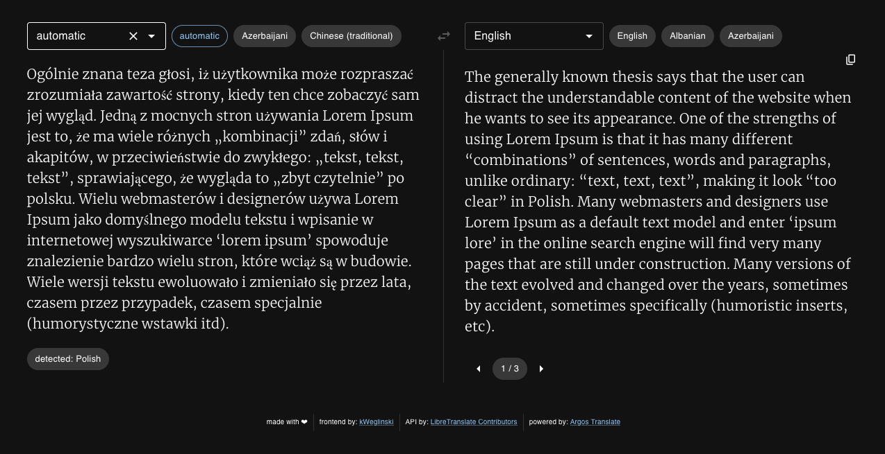

# Pole LibreTranslate Frontend

This is a frontend app that uses LibreTranslate as a backend.

I didn't like the fact that original app that comes with libre translate doesn't remember my previous language choices therefore I've decided to make my own frontend. That also allows me to clean it up visually.

<p align="center">
  
</p>

## How to run: Docker

The most recommended way to start it up is to use Docker.

Here's a sample docker compose:

```
  pole-libretranslate:
    restart: unless-stopped
    environment:
      API: https://your.libretranslate.instance
      # pick one of: 'pole' | 'light' | 'dark' 
      THEME: 'dark'
    ports:
      - 80:80
    image: kweg/pole-libretranslate:latest
```

## How to run: Code

this is a standard Vite setup. Simply run: `npm run install` and then `npm run dev`. You'll also have to either go to index.html and change window vars (similarly to docker one)

Or

Use url param `localhost:5173/?api=https://your.api.instance`

## React + TypeScript + Vite

This template provides a minimal setup to get React working in Vite with HMR and some ESLint rules.

Currently, two official plugins are available:

- [@vitejs/plugin-react](https://github.com/vitejs/vite-plugin-react/blob/main/packages/plugin-react/README.md) uses [Babel](https://babeljs.io/) for Fast Refresh
- [@vitejs/plugin-react-swc](https://github.com/vitejs/vite-plugin-react-swc) uses [SWC](https://swc.rs/) for Fast Refresh

### Expanding the ESLint configuration

If you are developing a production application, we recommend updating the configuration to enable type aware lint rules:

- Configure the top-level `parserOptions` property like this:

```js
export default {
  // other rules...
  parserOptions: {
    ecmaVersion: 'latest',
    sourceType: 'module',
    project: ['./tsconfig.json', './tsconfig.node.json'],
    tsconfigRootDir: __dirname,
  },
}
```

- Replace `plugin:@typescript-eslint/recommended` to `plugin:@typescript-eslint/recommended-type-checked` or `plugin:@typescript-eslint/strict-type-checked`
- Optionally add `plugin:@typescript-eslint/stylistic-type-checked`
- Install [eslint-plugin-react](https://github.com/jsx-eslint/eslint-plugin-react) and add `plugin:react/recommended` & `plugin:react/jsx-runtime` to the `extends` list
